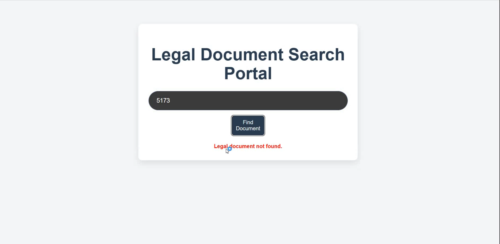
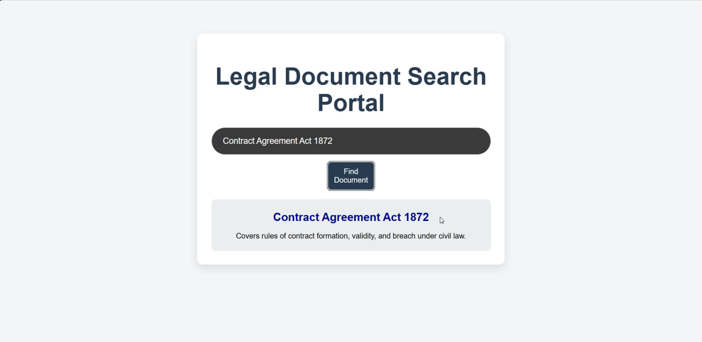

# Legal Document Search Portal
A full-stack web application to search for summarized legal documents

## Setup Instructions

### Setup by leveraging docker (recommended)
- download docker desktop
- clone the repository
- run docker desktop engine
- move to the root folder
- execute the command `docker compose up --build`
- move to browser and hit the url `http://localhost:5173`

### Setup locally (without docker)
- from root directory, move inside `backend` directory
- execute `python -m venv venv`
- activate virtual environment by executing `venv\Scripts\activate` and for linux or mac, execute command `source venv/bin/activate`
- install backend dependencies by running the command `pip install -r requirements.txt`
- finally, run the backend server by initiating command `uvicorn app:app --reload`
- for frontend execution, move to frontend folder from root folder and run the command `npm run dev`

## Demo Video [Link](https://youtu.be/EiTDh9Zzhok?si=GVSwyJPx1Sw7wU7K)

## SnapShots

   
